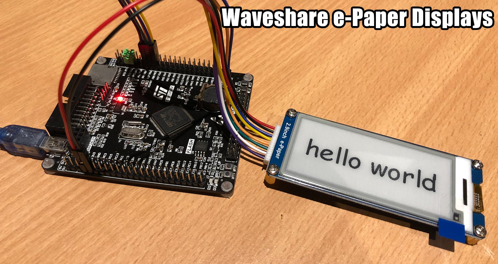

# MicroPython Waveshare e-Paper

MicroPython drivers for various Waveshare e-Paper displays, based on the original Waveshare Raspberry Pi examples found in the [wiki](https://www.waveshare.com/wiki/Main_Page).

| Waveshare e-Paper Module                                                                  | Colors               | Grey Level | Resolution px | Display mm     | Outline mm    | Partial Refresh | Full Refresh | Interface | Pi Header | Controller | Display                                                                       |
| ----------------------------------------------------------------------------------------- | -------------------- |:----------:|:-------------:|:--------------:|:-------------:|:---------------:|:------------:|:---------:|:---------:|:-----------|:-----------------------------------------------------------------------------:|
| [1.54inch e-Paper Module](https://www.waveshare.com/wiki/1.54inch_e-Paper_Module)         | Black, White         | 2          | 200 × 200     | 27.60 × 27.60  | 48.0 × 33.0   | 0.3             | 2            | SPI       | No        | ?          | [GDEH0154D27](http://www.good-display.com/products_detail/productId=365.html) |
| [1.54inch e-Paper Module (B)](https://www.waveshare.com/wiki/1.54inch_e-Paper_Module_(B)) | Black, White, Red    | 2          | 200 × 200     | 27.60 × 27.60  | 48.0 × 33.0   | N/A             | 8            | SPI       | No        | ?          | [GDEW0154Z04](http://www.good-display.com/products_detail/productId=307.html) |
| [1.54inch e-Paper Module (C)](https://www.waveshare.com/wiki/1.54inch_e-Paper_Module_(C)) | Black, White, Yellow | 2          | 152 × 152     | 27.51 × 27.51  | 48.0 × 33.0   | N/A             | 27           | SPI       | No        | ?          | [GDEW0154C39](http://www.good-display.com/products_detail/productId=385.html) |
| [2.13inch e-Paper HAT](https://www.waveshare.com/wiki/2.13inch_e-Paper_HAT)               | Black, White         | 2          | 250 × 122     | 48.55 × 23.71  | 65.0 × 30.2   | 0.3             | 2            | SPI       | Yes       | IL3895     | [GDEH0213B1](http://www.good-display.com/products_detail/productId=346.html)  |
| [2.13inch e-Paper HAT (B)](https://www.waveshare.com/wiki/2.13inch_e-Paper_HAT_(B))       | Black, White, Red    | 2          | 212 × 104     | 48.55 × 23.71  | 65.0 × 30.2   | N/A             | 15           | SPI       | Yes       | ?          | [GDEW0213Z16](http://www.good-display.com/products_detail/productId=310.html) |
| [2.13inch e-Paper HAT (C)](https://www.waveshare.com/wiki/2.13inch_e-Paper_HAT_(C))       | Black, White, Yellow | 2          | 212 × 104     | 48.55 × 23.71  | 65.0 × 30.2   | N/A             | 15           | SPI       | Yes       | ?          | [GDEW0213C38](http://www.good-display.com/products_detail/productId=380.html) |
| [2.7inch e-Paper HAT](https://www.waveshare.com/wiki/2.7inch_e-Paper_HAT)                 | Black, White         | 2          | 264 × 176     | 57.29 × 38.19  | 85.0 × 56.0   | N/A             | 6            | SPI       | Yes       | ?          | [GDEW027W3](http://www.good-display.com/products_detail/productId=319.html)   |
| [2.7inch e-Paper HAT (B)](https://www.waveshare.com/wiki/2.7inch_e-Paper_HAT_(B))         | Black, White, Red    | 2          | 264 × 176     | 57.29 × 38.19  | 85.0 × 56.0   | N/A             | 15           | SPI       | Yes       | ?          | [GDEW027C44](http://www.good-display.com/products_detail/productId=320.html)  |
| [2.9inch e-Paper Module](https://www.waveshare.com/wiki/2.9inch_e-Paper_Module)           | Black, White         | 2          | 296 × 128     | 66.89 × 29.05  | 89.5 × 38.0   | 0.3             | 2            | SPI       | No        | IL3820     | [GDEH029A1](http://www.good-display.com/products_detail/productId=251.html)   |
| [2.9inch e-Paper Module (B)](https://www.waveshare.com/wiki/2.9inch_e-Paper_Module_(B))   | Black, White, Red    | 2          | 296 × 128     | 66.89 × 29.05  | 89.5 × 38.0   | N/A             | 15           | SPI       | No        | IL3820?    | [GDEW029Z10](http://www.good-display.com/products_detail/productId=308.html)  |
| [2.9inch e-Paper Module (C)](https://www.waveshare.com/wiki/2.9inch_e-Paper_Module_(C))   | Black, White, Yellow | 2          | 296 × 128     | 66.89 × 29.05  | 89.5 × 38.0   | N/A             | 15           | SPI       | No        | IL3820?    | [GDEW029C32](http://www.good-display.com/products_detail/productId=378.html)  |
| [4.2inch e-Paper Module](https://www.waveshare.com/wiki/4.2inch_e-Paper_Module)           | Black, White         | 2          | 400 × 300     | 84.80 × 63.60  | 103.0 × 78.5  | N/A             | 4            | SPI       | No        | ?          | [GDEW042T2](http://www.good-display.com/products_detail/productId=321.html)   |
| [4.2inch e-Paper Module (B)](https://www.waveshare.com/wiki/4.2inch_e-Paper_Module_(B))   | Black, White, Red    | 2          | 400 × 300     | 84.80 × 63.60  | 103.0 × 78.5  | N/A             | 15           | SPI       | No        | ?          | [GDEW042Z15](http://www.good-display.com/products_detail/productId=322.html)  |
| [4.2inch e-Paper Module (C)](https://www.waveshare.com/wiki/4.2inch_e-Paper_Module_(C))   | Black, White, Yellow | 2          | 400 × 300     | 84.80 × 63.60  | 103.0 × 78.5  | N/A             | 15           | SPI       | No        | ?          | [GDEW042C37](http://www.good-display.com/products_detail/productId=379.html)  |
| [4.3inch e-Paper UART Module](https://www.waveshare.com/wiki/4.3inch_e-Paper_UART_Module) | Black, White         | 4          | 800 × 600     | 88.00 × 66.00  | 118.0 × 75.0  | N/A             | 1.5          | UART      | No        | ?          | [GDE043A2](http://www.good-display.com/products_detail/productId=361.html)    |
| [5.83inch e-Paper HAT](https://www.waveshare.com/wiki/5.83inch_e-Paper_HAT)               | Black, White         | 2          | 600 × 448     | 118.8 × 88.26  | 125.4 × 99.5  | N/A             | 3.5          | SPI       | Yes       | ?          | [GDEW0583T7](http://www.good-display.com/products_detail/productId=387.html)  |
| [5.83inch e-Paper HAT (B)](https://www.waveshare.com/wiki/5.83inch_e-Paper_HAT_(B))       | Black, White, Red    | 2          | 600 × 448     | 118.8 × 88.26  | 125.4 × 99.5  | N/A             | 14           | SPI       | Yes       | ?          | [GDEW0583Z21](http://www.good-display.com/products_detail/productId=383.html) |
| [5.83inch e-Paper HAT (C)](https://www.waveshare.com/wiki/5.83inch_e-Paper_HAT_(C))       | Black, White, Yellow | 2          | 600 × 448     | 118.8 × 88.26  | 125.4 × 99.5  | N/A             | 26           | SPI       | Yes       | ?          | [GDEW0583C64](http://www.good-display.com/products_detail/productId=388.html) |
| [7.5inch e-Paper HAT](https://www.waveshare.com/wiki/7.5inch_e-Paper_HAT)                 | Black, White         | 2          | 600 × 384     | 163.20 × 97.92 | 170.2 × 111.2 | N/A             | 6            | SPI       | Yes       | ?          | [GDEW075T8](http://www.good-display.com/products_detail/productId=323.html)   |
| [7.5inch e-Paper HAT (B)](https://www.waveshare.com/wiki/7.5inch_e-Paper_HAT_(B))         | Black, White, Red    | 2          | 640 × 384     | 163.20 × 97.92 | 170.2 × 111.2 | N/A             | 31           | SPI       | Yes       | ?          | [GDEW075Z09](http://www.good-display.com/products_detail/productId=324.html)  |
| [7.5inch e-Paper HAT (C)](https://www.waveshare.com/wiki/7.5inch_e-Paper_HAT_(C))         | Black, White, Yellow | 2          | 640 × 384     | 163.20 × 97.92 | 170.2 × 111.2 | N/A             | 31           | SPI       | Yes       | ?          | [GDEW075C21](http://www.good-display.com/products_detail/productId=381.html)  |

## Links

* [Waveshare Wiki](https://www.waveshare.com/wiki/Main_Page)
* [micropython.org](http://micropython.org)
* [Docs on framebuf](http://docs.micropython.org/en/latest/pyboard/library/framebuf.html)

## License

Licensed under the [MIT License](http://opensource.org/licenses/MIT).
